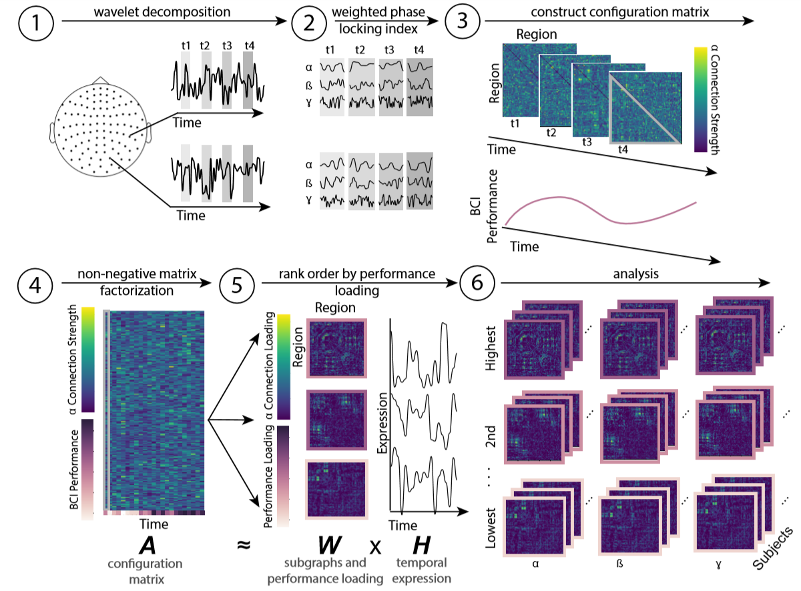

# Learning in brain-computer interface control evidenced by joint decomposition of brain and behavior
This repository contains all the code necessary to reproduce the analyses in [this paper](https://iopscience.iop.org/article/10.1088/1741-2552/ab9064). In this paper, we explore the mesoscale organization of functional networks supporting brain computer interface learning.

#### Required Package
* Required matlab toolboxes: eeglab, fieldtrip
* Required python toolboxes: os, numpy, scipy, sys, (NMF from https://github.com/akhambhati/Echobase/tree/master/Echobase/Network/Partitioning/Subgraph)
* Required R toolboxes: R.matlab, ggplot2, dplyr, coin, lmPer, car, aplpack, RColorBrewer, wesanderson, ez, plyr

# Instructions
## Preprocessing
### Functional Connectivity and Behavior
Data is very clean, so minimal preprocessing is needed
* Run preproc_behav.m to get summary statistics for each subjects performance and learning rate (slope)
* Run preproc_wpli and preproc_wpli_pr.m to make FC data and phase randomized FC data. 
  * This will call the function wrapper_wpli.m and wrapper_pr_wpli.m. This script will combine planar gradiometers using a helper function from fieldtrip, calculate the wPLI using custom helper function get_window_wpli.m for each trial, and save a matrix for each session. The function outputs any errors in the pipeline
### NMF
* Run format_NMF_wpli.m. This saves a single connection matrix of FC and performance for each subject/band.
* For every subject/band combination, run NMF_pipe_wpli.py and NMF_pipe_wpli_pr.py. This was done on the cluster, where each dataset was a job. The performs the NMF decomposition, and saves the selected parameters (alpha, beta, and m), the error, as well as the loadings and temporal coefficients
### Analysis
#### Identifying outlier subgraphs
* Run get_noise_sg.m. This will create an index of subgraph that are not regularized for empirical and UPR data. This index will be called in future scripts
#### Figure 2: Performance
* Run behavior.R. This script essentially just plots data loaded from a mat file. It also does a repeated measures anova on the subjects average performance

#### Figure 3: Relationship between learning rate and performance loading
* Run exp_beh_wpli.m. All this script does is reformat some of the data so that it can be analyzed in R. It combines performance data with ranked loading data
* Run exp_beh_corr_wpli.R. This will generate figures and statistics for fig 2
#### Figure 4: Consensus subgraphs
* Run consensus_subgraphs.m. This calls thresh.mat. A helper function for thresholding matrices. This will create the consensus networks, where each edge is the number of subjects that have a given edge in the X% strongest connections of their subgraph. This also makes some files for plotting. It also saves the average consistency for each graph
  * Plots are made in gephi. You will need to run make_gml.py to make files for gephi
* Run consistent_subgraphs_pr.m. to repeat this process for null data.
* Run compare_consensistency.m. to compare consistency between null and empirical data
* Run consistent_edge_location.m. to get lobes of the most consistent edges
* Run consistent_check_norm.R. to get quantile-quantile plots of consistency

### Figure 5: Temporal coefficients across subgraphs
* Run temp_exp.m. This reformats data about the energy, and peak of temporal expression across subgraphs for analysis in R
* Run temp_exp.R. This makes the plot and statistics for figure 4.
### Figure 6: Control energy predicts learning rate
* Run get_oc_parameters.m This will find parameters that will give low error
* Run optimal_control_MI.m This generates data for most selectivity analyses, as well as positive and negative controls
* Run density_slope.m to get density data. This is used to see if effects are above and beyond what is expected from density
* Run optimal_control_state_variations.m and optimal_control_magnitude.m This generates data for all the state specific controls
* Run optimal_control_alt_params.m This generates data for different parameter sets
* Run opt_energy.R to generate all plots and statistics in the paper
### Supplemental Figures
* NMF parameter distributions and comparisons: run NMF_parameters.ipynb
* Comparison of the Number of Triangles: 
  * Run consistency_thresh.m to explore consistency at different thresholds
* Model Validation:
  * Run count_triangles.m
  * Run compare_triangles.R
  * Run make_states.m, which calls get_mtmfft_power.m to get states (z-scored power across channels)
  * Run model_vaidation.m
  * Run model_validation_all_sg.m
  * Run model_validation_stats.R

#### Assorted troubleshooting Notes
* Singular matrix: there are a couple sources for this. (1) your original data is not full rank (2) you data is transposed, make sure what you submit is nWin x nCon, the code does not check (3) Subgraph partitioning creates rank deficient matrices, lowering the max rank will help with this

## Contributors to Code
* Jennifer Stiso
